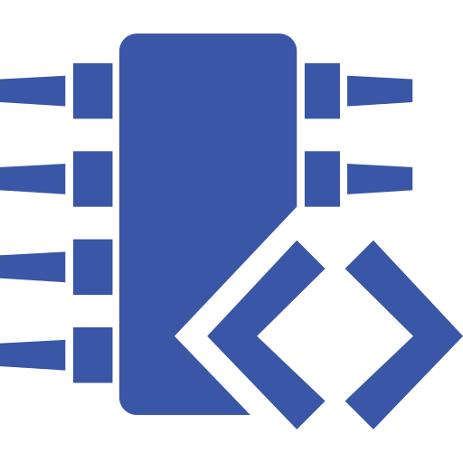

Hi, I'm Sage, I'm an Independent Developer. I have- what is going on to be- 4 years of experience in the software development industry. I love tinkering with vintage computers; I also do a bit of music and art on the side.

For any business inqueries, feel free to contact me at <sage.message@email.com>.  
Alternatively, as a general contact, you can find me on discord  

### Tech Stack

<!-- GitHub Stats -->

